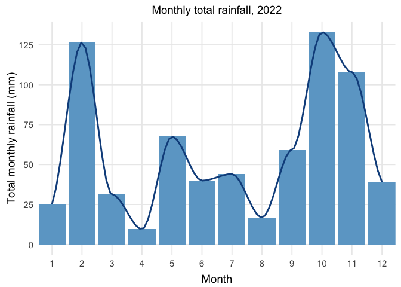
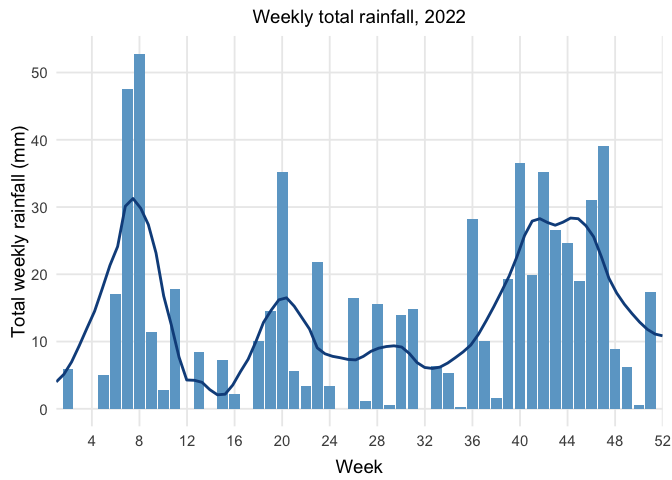
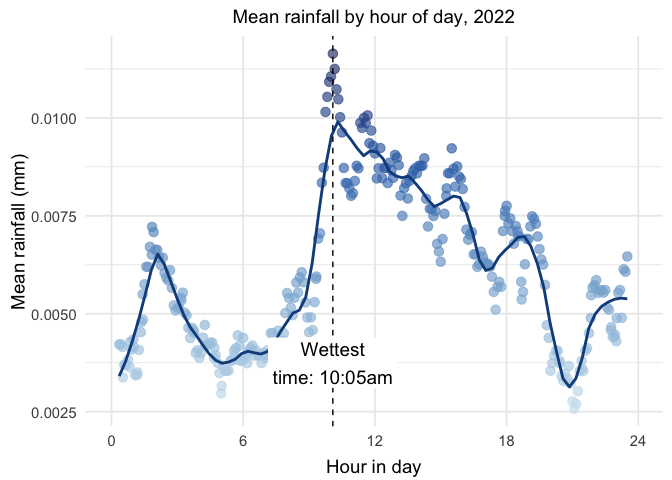
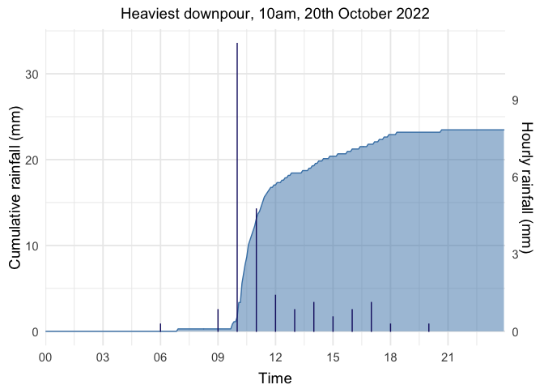

These data were collected from my home weather station in York, comprising a set of weather instruments (wind vane and anemometer, rain gauge, temperature, pressure, humidity, and light sensors), Pimoroni Weather HAT, and Raspberry Pi Zero W computer.

More details and explanation of the analysis below here: [https://sandyjmacdonald.github.io/2022/12/30/analysing-a-year-of-rainfall-data/](https://sandyjmacdonald.github.io/2022/12/30/analysing-a-year-of-rainfall-data/)

## Loading libraries and reading in the raw data


```r
options(warn=-1)

library(influxdbr)
library(xts)
library(lubridate)
library(tidyverse)
library(zoo)
library(scales)
library(knitr)
library(RColorBrewer)
library(colorspace)

setwd(dirname(rstudioapi::getActiveDocumentContext()$path))
```


```r
tibble = read_csv("2022-rainfall-data.csv")
tibble$time = ymd_hms(tibble$time, tz="GMT")
head(tibble)
```

```
## # A tibble: 6 × 2
##   time                rain_mm
##   <dttm>                <dbl>
## 1 2022-12-30 08:25:00       0
## 2 2022-12-30 08:20:00       0
## 3 2022-12-30 08:15:00       0
## 4 2022-12-30 08:10:00       0
## 5 2022-12-30 08:05:00       0
## 6 2022-12-30 08:00:00       0
```

## Adding more time annotations

To make grouping, summing, and averaging the data easier, we'll use Lubridate's functions to add more time annotations, to be used later.


```r
tibble$year = year(tibble$time)
tibble$week = week(tibble$time)
tibble$month = month(tibble$time)
tibble$day = day(tibble$time)
tibble$yday = yday(tibble$time)
tibble$hour = hour(tibble$time)
tibble$minute = minute(tibble$time)
tibble$minuteinday = (tibble$hour * 60) + tibble$minute

tibble = tibble %>%
  filter(year == 2022) %>%
  select(time, year, month, week, day, yday, hour, minuteinday, rain_mm) %>%
  arrange(time)

head(tibble)
```

```
## # A tibble: 6 × 9
##   time                 year month  week   day  yday  hour minuteinday rain_mm
##   <dttm>              <dbl> <dbl> <dbl> <int> <dbl> <int>       <dbl>   <dbl>
## 1 2022-01-01 00:00:00  2022     1     1     1     1     0           0       0
## 2 2022-01-01 00:05:00  2022     1     1     1     1     0           5       0
## 3 2022-01-01 00:10:00  2022     1     1     1     1     0          10       0
## 4 2022-01-01 00:15:00  2022     1     1     1     1     0          15       0
## 5 2022-01-01 00:20:00  2022     1     1     1     1     0          20       0
## 6 2022-01-01 00:25:00  2022     1     1     1     1     0          25       0
```

## Monthly total rainfall

Let's group the and sum the data by month, and plot the monthly rainfall.


```r
monthly = tibble %>%
  group_by(month) %>%
  summarise(rain_mm = sum(rain_mm)) %>%
  ungroup()

m = ggplot() +
  geom_col(data=monthly,
           aes(x=month, y=rain_mm),
           fill="skyblue3",
           position="dodge") +
  stat_smooth(data=monthly,
              aes(x=month, y=rain_mm),
              colour="dodgerblue4",
              level=0.0,
              span=0.25) +
  scale_x_continuous(breaks=breaks_pretty(12), expand=c(0,0)) +
  scale_y_continuous(breaks=seq(0,150,25)) +
  theme_minimal(base_size=14) +
  theme(panel.grid.minor = element_blank()) +
  theme(plot.title=element_text(size=14, hjust=0.5),
        legend.position="none", 
        axis.title.x = element_text(vjust=-0.5),
        axis.title.y = element_text(vjust=0.5)) +
  xlab("Month") + ylab("Total monthly rainfall (mm)") +
  ggtitle("Monthly total rainfall, 2022")

m
```

<!-- -->

```r
ggsave("plots/2022-monthly-rainfall.jpg", dpi=300, width=10, height=5, plot=m, bg="white")
```

Let's also make a table of those data:


```r
monthly %>%
  arrange(-rain_mm) %>%
  mutate(month=month.name[month]) %>%
  kable(format = "markdown", digits=1)
```


|month     | rain_mm|
|:---------|-------:|
|October   |   133.0|
|February  |   126.6|
|November  |   107.8|
|May       |    67.6|
|September |    59.2|
|July      |    44.1|
|June      |    40.0|
|December  |    39.1|
|March     |    31.3|
|January   |    25.1|
|August    |    16.8|
|April     |     9.5|

## Weekly total rainfall

Let's do the same, but group it by week instead, to get more granularity.


```r
weekly = tibble %>%
  group_by(week) %>%
  summarise(rain_mm = sum(rain_mm)) %>%
  ungroup()

w = ggplot() +
  geom_col(data=weekly,
           aes(x=week, y=rain_mm),
           fill="skyblue3",
           position="dodge") +
  stat_smooth(data=weekly,
              aes(x=week, y=rain_mm),
              colour="dodgerblue4",
              level=0.0,
              span=0.25) +
  scale_x_continuous(breaks=seq(0,52,4), expand=c(0,0), limits=c(1,52)) +
  scale_y_continuous(breaks=seq(0,60,10)) +
  theme_minimal(base_size=14) +
  theme(panel.grid.minor = element_blank()) +
  theme(plot.title=element_text(size=14, hjust=0.5),
        legend.position="none",
        axis.title.x = element_text(vjust=-0.5),
        axis.title.y = element_text(vjust=0.5)) +
  xlab("Week") + ylab("Total weekly rainfall (mm)") +
  ggtitle("Weekly total rainfall, 2022")

w
```

<!-- -->

```r
ggsave("plots/2022-weekly-rainfall.jpg", dpi=300, width=10, height=5, plot=w, bg="white")
```

## Wettest days

When were the wettest days of the year? Let's group the data by day and sum it.


```r
daily = tibble %>%
  mutate(date=floor_date(time, unit="day")) %>%
  group_by(date) %>%
  summarise(rain_mm = sum(rain_mm)) %>%
  ungroup() %>%
  mutate(yday=yday(date), month=month(date)) %>%
  arrange(-rain_mm)

daily %>%
  select(date, rain_mm) %>%
  top_n(n=5) %>%
  mutate(date=format(date, "%e %B")) %>%
  kable(format = "markdown", digits=1)
```


|date        | rain_mm|
|:-----------|-------:|
|20 February |    24.3|
|20 October  |    23.5|
|18 February |    21.0|
|16 May      |    18.4|
|17 November |    15.4|

## Driest months

Let's classify days as dry (0mm rainfall) or wet (> 0mm rainfall) and then use that as a measure of the driest months.


```r
dry_wet <- tibble %>%
  mutate(date=floor_date(time, unit="day")) %>%
  group_by(date) %>%
  summarise(rain_mm = sum(rain_mm)) %>%
  mutate(dry=if_else(rain_mm==0, "dry", "wet"),
         month=month(date))

dry_wet %>%
  filter(dry=="dry") %>%
  group_by(month) %>%
  summarise(dry_days=n()) %>%
  ungroup() %>%
  arrange(-dry_days) %>%
  mutate(month=month.name[month]) %>%
  kable(format = "markdown")
```


|month     | dry_days|
|:---------|--------:|
|April     |       26|
|January   |       21|
|March     |       21|
|June      |       20|
|August    |       18|
|July      |       16|
|December  |       14|
|September |       12|
|May       |       11|
|February  |       10|
|November  |        8|
|October   |        7|

## Longest dry and wet spells

When were the longest dry and wet spells?

Longest dry spell:


```r
dry_days <- dry_wet %>%
  filter(dry=="dry") %>%
  mutate(yday=yday(date)) %>%
  arrange(yday)

d_temp <- cumsum(c(1, diff(dry_days$yday) - 1))
d_temp2 <- rle(d_temp)
days <- dry_days$yday[which(d_temp == with(d_temp2, values[which.max(lengths)]))]

dry_days[dry_days$yday == min(days),]$date
```

```
## [1] "2022-01-15 GMT"
```

```r
dry_days[dry_days$yday == max(days),]$date
```

```
## [1] "2022-01-29 GMT"
```

Longest wet spell:


```r
wet_days <- dry_wet %>%
  filter(dry=="wet") %>%
  mutate(yday=yday(date)) %>%
  arrange(yday)

w_temp <- cumsum(c(1, diff(wet_days$yday) - 1))
w_temp2 <- rle(w_temp)
days <- wet_days$yday[which(w_temp == with(w_temp2, values[which.max(lengths)]))]

wet_days[wet_days$yday == min(days),]$date
```

```
## [1] "2022-11-15 GMT"
```

```r
wet_days[wet_days$yday == max(days),]$date
```

```
## [1] "2022-11-27 GMT"
```

## Wettest time of day

When was the wettest time of day? By grouping the whole year's worth of data by the "minute in the day", we should be able to find this. **Note that mean values > 0.2mm were filtered out to remove some outliers that were skewing the plot.**


```r
daily_mean = tibble %>%
  group_by(minuteinday) %>%
  summarise(rain_mm=mean(rain_mm), hour=hour) %>%
  ungroup() %>%
  unique() %>%
  filter(rain_mm < 0.2) %>%
  mutate(rain_mm=rollmean(rain_mm, 12, na.pad=TRUE, align="center"))

d = ggplot() +
  geom_point(data=daily_mean,
             aes(x=minuteinday/60, y=rain_mm, color=rain_mm),
             alpha=0.65,
             size=3) +
  geom_smooth(data=daily_mean,
              aes(x=minuteinday/60, y=rain_mm, alpha=1.0),
              span=0.15,
              colour="dodgerblue4",
              level=0.0) + 
  geom_vline(xintercept=605/60,
             linetype="dashed") +
  annotate("label", label = "Wettest\ntime: 10:05am",
           x = 605/60, y = 0.00375,
           size = 5, colour = "black",
           hjust=0.5, label.size = NA) +
  scale_colour_continuous_sequential(palette="Blues", rev=TRUE, begin=0.2) +
  scale_x_continuous(breaks=seq(0,24,6), minor_breaks=NULL) +
  theme_minimal(base_size=14) +
  theme(plot.title=element_text(size=14, hjust=0.5),
        legend.position="none",
        axis.title.x = element_text(vjust=-0.5),
        axis.title.y = element_text(vjust=0.5)) +
  xlab("Hour in day") + ylab("Mean rainfall (mm)") +
  ggtitle("Mean rainfall by hour of day, 2022")

d
```

<!-- -->

```r
ggsave("plots/2022-daily-mean-rainfall.jpg", dpi=300, width=10, height=5, plot=d, bg="white")
```

## Biggest downpour

When were the biggest downpours, specifically the largest amount of rainfall in an hour? 

Let's group the data by day and hour, sum it, arrange from largest to smallest, and then show the top 5:


```r
tibble %>%
  mutate(time=floor_date(time, unit="hour")) %>%
  group_by(yday, hour) %>%
  summarise(time, rain_mm=sum(rain_mm)) %>%
  arrange(-rain_mm) %>%
  ungroup() %>%
  unique() %>%
  top_n(n=5) %>%
  select(time, rain_mm) %>%
  mutate(time=format(time, "%e %B, %l%p")) %>%
  kable(format = "markdown", digits=1)
```


|time              | rain_mm|
|:-----------------|-------:|
|20 October, 10am  |    11.2|
|9 May, 11am       |    10.1|
|8 June,  1am      |     6.1|
|7 October, 11am   |     5.9|
|16 February,  3pm |     5.6|
|8 November,  1pm  |     5.6|
|24 November,  3pm |     5.6|

Let's also make a plot of the rainfall on the day with the biggest downpour, 20th October:


```r
downpour = tibble %>%
  filter(day == 20 & month == 10) %>%
  arrange(time) %>%
  mutate(rain_cumul=cumsum(rain_mm))

downpour_hourly = downpour %>%
  group_by(hour) %>%
  summarise(rain_mm=sum(rain_mm) * 3, time=min(time)) %>%
  ungroup()

dp <- ggplot() +
  geom_area(data=downpour, aes(x=time, y=rain_cumul), colour="steelblue", fill="steelblue", alpha=0.5) + 
  geom_col(data=downpour_hourly, aes(x=time, y=rain_mm), colour="midnightblue", fill="midnightblue", width=1, position="dodge") +
  # scale_y_continuous(limits=c(0,35), breaks=seq(0,30,10)) +
  scale_y_continuous(sec.axis = sec_axis(~./3, name = "Hourly rainfall (mm)")) +
  scale_x_datetime(date_labels = '%H', 
                   limits = c(as.POSIXct('2022-10-20 00:00:00', tz = 'UTC'), 
                              as.POSIXct('2022-10-20 23:59:00', tz = 'UTC')), 
                   breaks = '3 hours', expand=c(0,0)) +
  theme_minimal(base_size=14) +
  theme(plot.title=element_text(size=14, hjust=0.5), legend.position="none", axis.title.x = element_text(vjust=-0.5), axis.title.y = element_text(vjust=0.5)) +
  xlab("Time") + ylab("Cumulative rainfall (mm)") +
  ggtitle("Heaviest downpour, 10am, 20th October 2022")

dp
```

<!-- -->

```r
ggsave("plots/2022-heaviest-downpour.jpg", dpi=300, width=10, height=5, plot=dp, bg="white")
```
